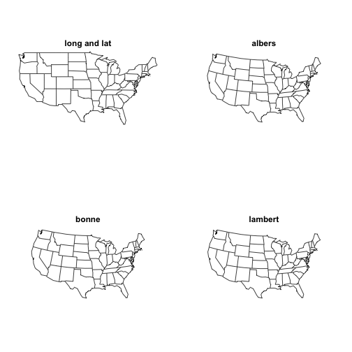
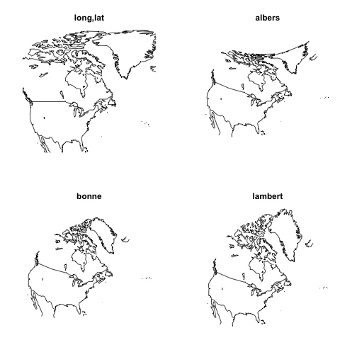

# Homework 1: Using R for Distances and Mapping
-----------------------------------------------------------------

* Homework 1 (lecture 1 slide 31)
* Spatial Statistics
* Daniel J. Hocking
* Started: 04 September 2013

## P0: Read Sections 3.1 and 3.2 of the text

## P1: Find the geo-coordinates (longitude, latitude) of New York, Seattle, and Los Angeles and calculate the pairwise distances:


```r
# Problem 1
library(maps)
library(mapproj)
library(knitr)

# From Google NYC = 40.6700° N, 73.9400° W LA = 34.0500° N, 118.2500° W
# Seattle (Sea) = 47.6097° N, 122.3331° W

NYC.lat <- 40.67
NYC.lon <- -73.94
LA.lat <- 34.05
LA.lon <- -118.25
Sea.lat <- 47.6097
Sea.lon <- -122.3331

# Convert to Radians
NYC.lat.rad <- NYC.lat * pi/180
NYC.lon.rad <- NYC.lon * pi/180
LA.lat.rad <- LA.lat * pi/180
LA.lon.rad <- LA.lon * pi/180
Sea.lat.rad <- Sea.lat * pi/180
Sea.lon.rad <- Sea.lon * pi/180
```


### a) naively: by using Euclidean distances directly on the longitude/latitude
Use Pythagorean theorem to solve

```r
distEuclid <- function(lat1, lon1, lat2, lon2) {
    sqrt((lat1 - lat2)^2 + (lon1 - lon2)^2)
}

dist.NYC.LA.deg <- distEuclid(NYC.lat, NYC.lon, LA.lat, LA.lon)
dist.NYC.LA <- distEuclid(NYC.lat.rad, NYC.lon.rad, LA.lat.rad, LA.lon.rad)
dist.NYC.Sea <- distEuclid(NYC.lat.rad, NYC.lon.rad, Sea.lat.rad, Sea.lon.rad)
dist.LA.Sea <- distEuclid(LA.lat.rad, LA.lon.rad, Sea.lat.rad, Sea.lon.rad)

Euclid.Dist <- data.frame(c(dist.NYC.LA, dist.NYC.Sea, dist.LA.Sea), row.names = c("dist.NYC.LA", 
    "dist.NYC.Sea", "dist.LA.Sea"))
names(Euclid.Dist) <- "Radians"
print(Euclid.Dist, dig = 4)
```

```
##              Radians
## dist.NYC.LA   0.7819
## dist.NYC.Sea  0.8533
## dist.LA.Sea   0.2472
```


The Euclidean distance from NYC to LA = 44.8018 degrees. Given the lack of projection, it is impossible to correctly convert this to relevant distances such as kilometers. In radians the distance = 0.78194 radians.


### b) correctly by using the geodesic distances

```r
distGeo <- function(lat1, lon1, lat2, lon2) {
    6378 * acos(sin(lat1) * sin(lat2) + cos(lat1) * cos(lat2) * cos(lon1 - lon2))
}

gdist.NYC.LA <- distGeo(NYC.lat.rad, NYC.lon.rad, LA.lat.rad, LA.lon.rad)
gdist.NYC.Sea <- distGeo(NYC.lat.rad, NYC.lon.rad, Sea.lat.rad, Sea.lon.rad)
gdist.LA.Sea <- distGeo(LA.lat.rad, LA.lon.rad, Sea.lat.rad, Sea.lon.rad)
```


The geodesic distances are:

```r
Geo.Dist <- data.frame(c(gdist.NYC.LA, gdist.NYC.Sea, gdist.LA.Sea), row.names = c("gdist.NYC.LA", 
    "gdist.NYC.Sea", "gdist.LA.Sea"))
names(Geo.Dist) <- "Km"
print(Geo.Dist, dig = 1)
```

```
##                 Km
## gdist.NYC.LA  3947
## gdist.NYC.Sea 3877
## gdist.LA.Sea  1548
```


The geodesic distance between NYC and LA is 3,947 km. For comparison with the previous answer, this can be divided by 6378 to convert to radians `gdist.NYC.LA` = 0.6188 radians (~20% shorter than unprojected Euclidean distance).

### c) by using straight line connections that cut through the earth (apply some geometry here)


```r
# Asssume earth sphere with diameter = 6378 km Calculate chord distance
# through sphere (3D Pythagorean Theorem)
r.earth <- 6378
delta.X <- cos(NYC.lat.rad) * cos(NYC.lon.rad) - cos(LA.lat.rad) * cos(LA.lon.rad)
delta.Y <- cos(NYC.lat.rad) * sin(NYC.lon.rad) - cos(LA.lat.rad) * sin(LA.lon.rad)
delta.Z <- sin(NYC.lat.rad) - sin(LA.lat.rad)
chord.rad <- sqrt(delta.X^2 + delta.Y^2 + delta.Z^2)
chord.km <- chord.rad * 6378

distChord <- function(lat1, lon1, lat2, lon2) {
    delta.X <- cos(lat1) * cos(lon1) - cos(lat2) * cos(lon2)
    delta.Y <- cos(lat1) * sin(lon1) - cos(lat2) * sin(lon2)
    delta.Z <- sin(lat1) - sin(lat2)
    chord.rad <- sqrt(delta.X^2 + delta.Y^2 + delta.Z^2)
    chord.km <- chord.rad * r.earth
    return(chord.km)
}

cdist.NYC.LA <- distChord(NYC.lat.rad, NYC.lon.rad, LA.lat.rad, LA.lon.rad)
cdist.NYC.Sea <- distChord(NYC.lat.rad, NYC.lon.rad, Sea.lat.rad, Sea.lon.rad)
cdist.LA.Sea <- distChord(LA.lat.rad, LA.lon.rad, Sea.lat.rad, Sea.lon.rad)
```


The Spherical chord distance between NYC and LA is 3,884 km (0.6090 radians). As expected, all chord distances are shorter than arc of sphere distances (geodesic)

The chord distances are:

```r
Chord.Dist <- data.frame(c(cdist.NYC.LA, cdist.NYC.Sea, cdist.LA.Sea), row.names = c("cdist.NYC.LA", 
    "cdist.NYC.Sea", "cdist.LA.Sea"))
names(Chord.Dist) <- "Km"
print(Chord.Dist, dig = 1)
```

```
##                 Km
## cdist.NYC.LA  3884
## cdist.NYC.Sea 3818
## cdist.LA.Sea  1544
```


## P2: Obtain a map of the US states and project it using the three popular
projections: Albers, Lambert and Bonne. Comment on the resulting graphs. Use:

```r
library(maps)
library(mapproj)
par(mfrow = c(2, 2), mar = c(0, 0, 2, 0))  # puts multiple graphs on page
map("state")
title("long and lat")
map("state", proj = "albers", par = c(30, 40))
title("albers")
map("state", proj = "bonne", param = 35)
title("bonne")
map("state", proj = "lambert", par = c(30, 40))
title("lambert")
```

 


The longitude and latitude projection changes the orientation of the states by stretching the top of the map more than the bottom compared with the other plots. The western border with Canada is also horizontal. The result is that Maine and Oregon appear much farther from each other and the states are oriented differently. At the size of the plots on my screen, the Albers, Bonne, and Lambert projections all apprea very similar. I expect that on a larger screen there would be differences in stretching/compression and orientation at some latitudes, particularly northern latitudes. [Update: see answer below, differences became more apparent with larger area projected]

## P3: Obtain a map that contains Greenland and the contiguous USA. Plot a long/lat map and then choose 3 projections – select appropriate parameters for these. Comment on the effect of the projections. R code for unprojected map:

```r
par(mfrow = c(2, 2), mar = c(0, 0, 2, 0))
map("world", xlim = c(-130, -20), ylim = c(25, 85))
title("long,lat")  # map.axes(); # optional: adds axes to the map!
map("world", proj = "albers", par = c(30, 40), xlim = c(-130, -20), ylim = c(25, 
    85))
title("albers")  # equal area
map("world", xlim = c(-130, -20), ylim = c(25, 85), proj = "bonne", param = 35)
title("bonne")  # equal spaced parallels, equal area projection
map("world", xlim = c(-130, -20), ylim = c(25, 85), proj = "lambert", par = c(30, 
    40))
title("lambert")  # conformal
```

 


The longitude-latitude plot makes Greenland look enormous. The orientation is also shifted. The Albers projections causes very significant distortion near the poles. Greenland is shown in appropriate area but not in shape. The Bonne projection keeps the areas equal but there appears to be shifting near the poles and the shape of Greenland appears longer and skinner. The Lambert projection is conformal so the angles between locations are preserved but the sizes are obscured. 

